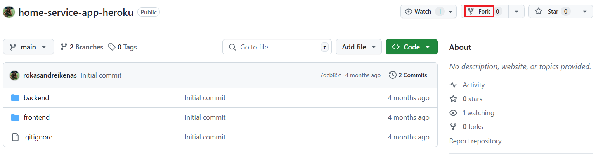
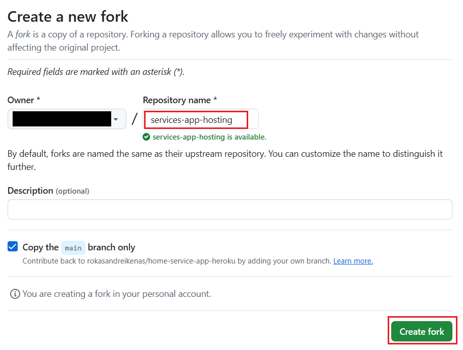
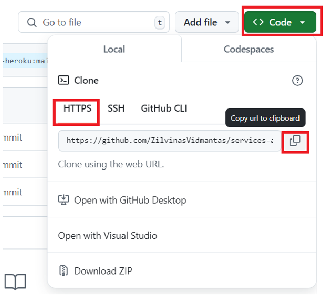
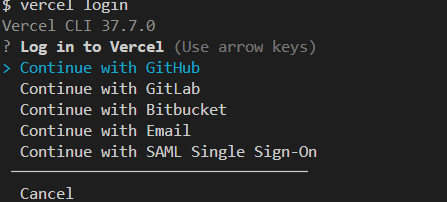
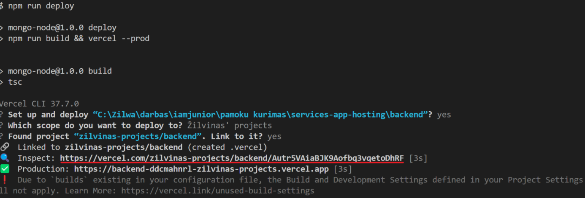
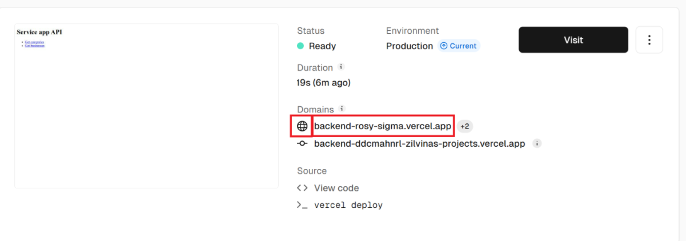

# Deploy'inimas naudojant Vercel

Ši pamoka parodys, kaip patalpinti fullstack aplikaciją, React frontend ir Node.js/Express backend, naudojant Vercel platformą.
Deploy'insim kiekvieną iš aplikacijų atskirai ir įgalinsime jų bendradarbiavimą.

## Repozitorijos sukūrimas

### Pasi'fork'inkite [repozitoriją](https://github.com/rokasandreikenas/home-service-app-heroku) 



### Repozitorijos parsiuntimas

* pasikopijuokite repozitorijos adresą


* parsisiųskite repozitoriją naudodami terminalą
```
git clone repozitorijos_adresas
```

* atsidarykite parsiųstą aplanką su VsCode ar kitu tekto redaktoriumi.

## Vercel parsiuntimas ir paskyros sukūrimas

* Įrašykite vercel cli (command line interface) globaliai
```
npm i -g vercel
```

* Prisijunkite
```
vercel login
```


* Atlikite prisijungimą naršyklėje

## Node/Express aplikacijos deploy'inimas

1. Įsirašykite visas reikiamas bibliotekas
```
npm i 

```

2. Įgalinkite statinių failų dalinimasi ir pridėkite pradinį html failą
```js
// backend/src/index.ts
...
import path from "path";

const app = express();
app.use(express.static(path.join(__dirname, "../", "public")));
...
```
```html
<!-- backend/public -->

 <!DOCTYPE html>
<html lang="en">
<head>
  <meta charset="UTF-8">
  <meta name="viewport" content="width=device-width, initial-scale=1.0">
  <title>Service app API</title>
</head>
<body>
  <h1>Service app API</h1>
  
  <ul>
    <li>
      <a href="./categories">Get categories</a>
    </li>
    <li>
      <a href="./businesses">Get businesses</a>
    </li>
  </ul>
</body>
</html>
```

3. Sukurkite vercel konfiguracijos failą

```json
// backend/vercel.json 
{
  "version": 2,
  "builds": [
    {
      "src": "dist/index.js",
      "use": "@vercel/node",
      "config": { "includeFiles": ["dist/**"] }
    }
  ],
  "routes": [
    {
      "src": "/(.*)",
      "dest": "dist/index.js"
    }
  ]
}
```
* "version": nurodo konfigūracijos failo versiją, šiuo atveju Vercel naudoja 2-ąją versiją.
* "builds": apibrėžia, ką Vercel turėtų sukompiliuoti ir kaip tai daryti.
  * "src": nurodo pagrindinį failą, kuris bus deploy'inamas.
  *   "use": nurodo, kad bus naudojama @vercel/node platforma Node.js projektams deploy'inti.
  *   "config": nurodoma, kad į diegimą reikia įtraukti visus failus esančius "dist" kataloge.
* "routes": apibrėžia maršrutizavimo taisykles.
  *   "src": nurodo, kad visi užklausų maršrutai (URL) turėtų būti apdorojami pagal šį pattern'ą.
  *   "dest": nurodo, kad visi užklausų prašymai turėtų būti nukreipti į "dist/index.js" failą.

4. Įrašykite biblioteką @vercel/node"
```
npm i -D @vercel/node
```

5. Sukurkite komandą su'build'inti projektą package.json
```js
// backend/package.json
{
  ...

  "scripts": {
    ...
    "deploy": "npm run build && vercel --prod"
  },
  ...
}
```

6. Įvykdykite komandą:
```
npm run deploy
```

Visuose žingsniuose pasirinkite default reikšmes spausdami "Enter"

Įvykus deploy'inimui nunaviguokite į deployment'o peržvalgos puslapį:


Peržiūrėkite savo aplikaciją pasirinkdami __pagrindinį__ domain'ą:



